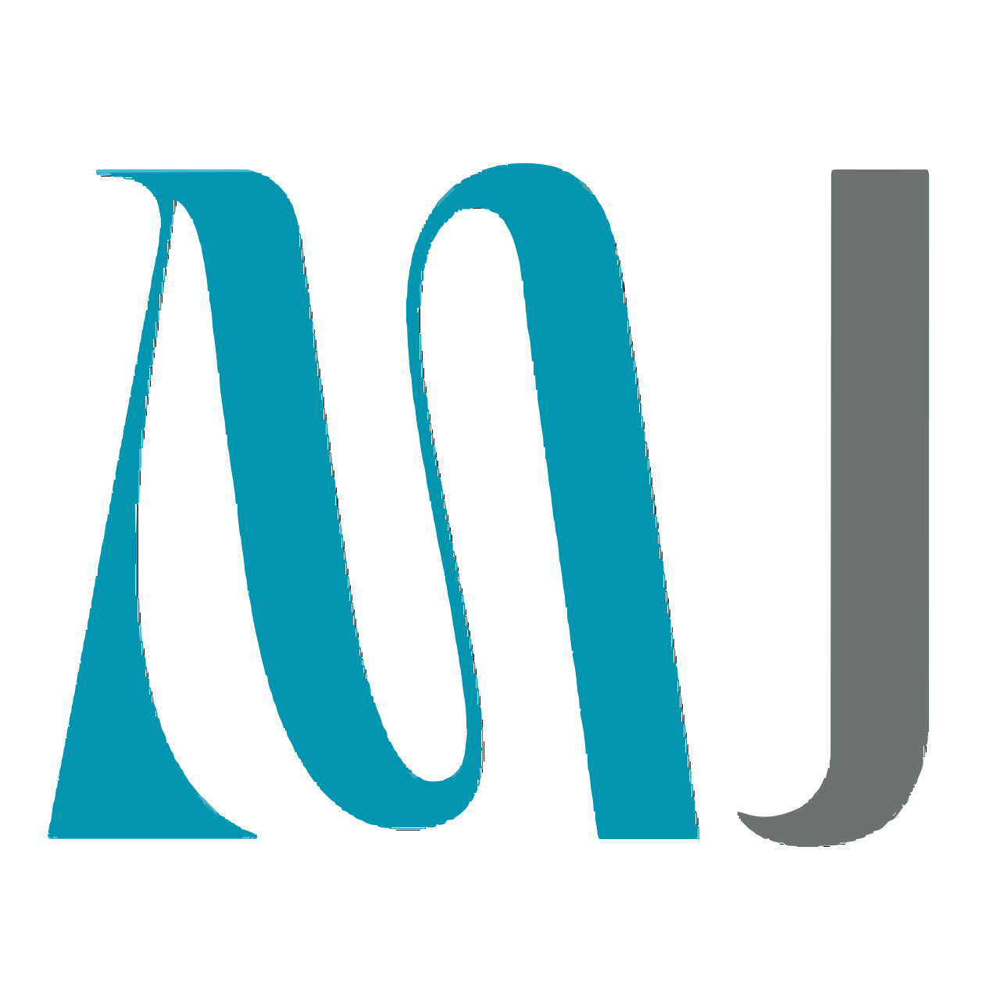

<a name="readme-top"></a>

<!-- PROJECT LOGO -->

<br />
<div align="center">
  <a href="https://github.com/mjwad/portfolio">
    
  </a>

  <p align="center">
    <br/>
    Explore my journey, projects, and passions in this immersive portfolio powered by React.
    <br/>
    <a href="https://mjwad.github.io/portfolio/">View Live Website</a>
    ·
    <a href="https://mjwad.github.io/portfolio/issues">Report Bug</a>
    ·
    <a href="https://mjwad.github.io/portfolio/issues">Request Feature</a>
  </p>
</div>

<!-- GETTING STARTED -->

## Getting Started

#### Built With


To get a local copy up and running follow these simple example steps.

### Prerequisites

  ```sh
  npm install npm@latest -g
  ```

### Installation

Clone the repo
  ```sh
  git clone https://github.com/mjwad/portfolio.git
  ```

Install NPM packages
  ```sh
  npm install
  ```

<p align="right"><a href="#readme-top">back to top</a></p>
<!-- LICENSE -->

### License
Distributed under the MIT License. See LICENSE.md for more information.

<p align="right"><a href="#readme-top">back to top</a></p>
<!-- QUESTIONS -->